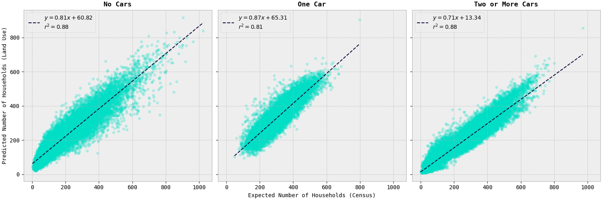
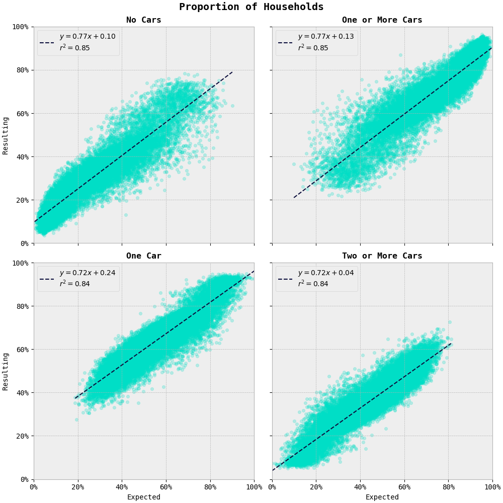
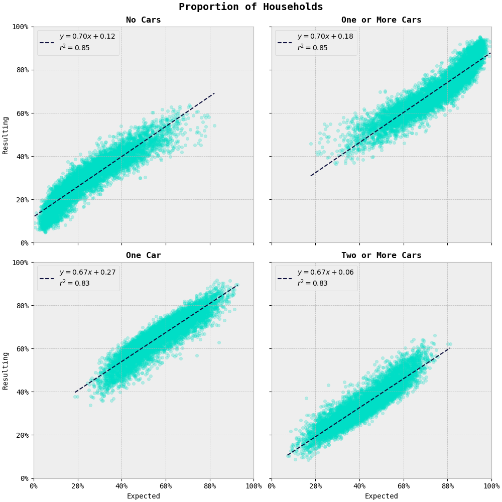
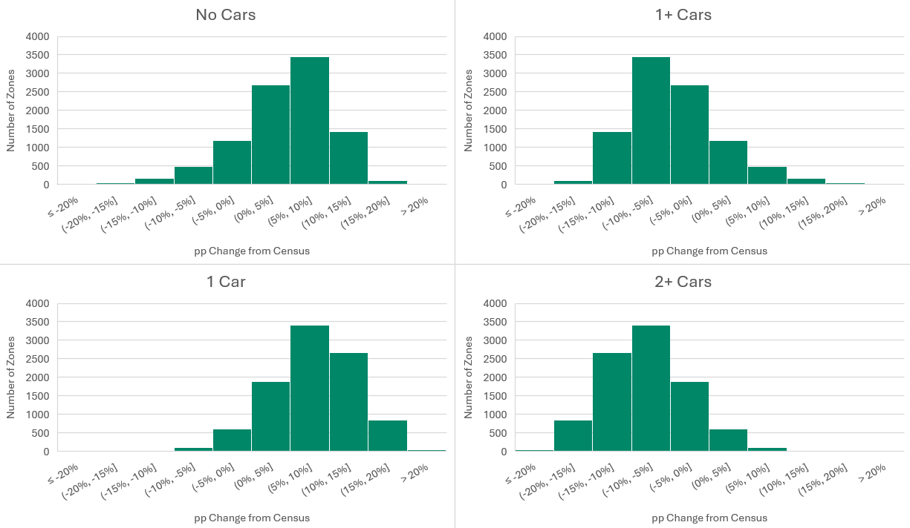
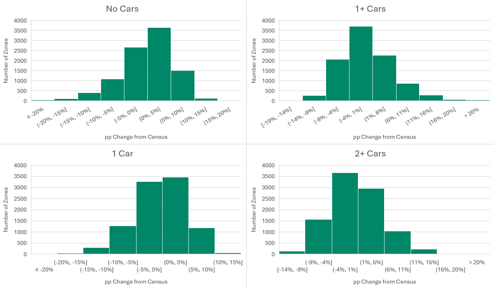

Calibration Adjustments
#######################

# TODO update all figs to something nice!

NorCOM is ultimately a statistical model that results in aggregate estimates of
how different zonal and household properties cause household car ownership to vary.
It is almost impossible to generate a statistical model like this that will perfectly
predict car ownership levels at a detailed zone level. This is largely because
car ownership decisions ultimately come down to the personal choices people make,
and there will always be exceptions to the aggregate rules.

To assess how well the estimated parameters reflect observed levels of car ownership,
we have compared NorCOM applied to the 2021 Population Model against the 2021 Census.

Total Households
================

:numref:`2021_hh` shows a comparison of the number of households by LSOA that
fall into the three different (modelled) car ownership categories between the 2021 Census and
the estimated parameters applied to the 2021 Land Use model.

.. _2021_hh:

   Number of Households by LSOA with 0, 1, or 2 or more cars; 2021 Census vs Land Use

Overall, while there are some biases in the slopes of these graphs, the :math:`{r}^{2}`
values are strong.

Zonal Shares
============

We have also looked at how the predicted probability shares of the model compare
to the shares observed in the 2021 Census data.

:numref:`2021_ew_shares` shows a comparison of
the zonal (LSOA) shares in car ownership between the 0 vs 1+ car owning, and 1 vs 2+ car
owning models. :numref:`2021_north_shares`
shows the same comparison for LSOAs in the three northern regions; Yorkshire and the Humber,
North East, and North West.

.. _2021_ew_shares:

   Proportion of Households by LSOA; 2021 Census vs Land Use

.. _2021_north_shares:

   Proportion of Households by LSOA; 2021 Census vs Land Use (North)

These show that, similarly to :numref:`2021_hh`, the zonal variation in model shares
is relatively small (shown by the strong :math:`{r}^{2}` values).

:numref:`2021_shares` shows a summary of the percentage point difference in model shares
by LSOA for the three northern regions between the Land Use model prediction and
the Census data.

.. _2021_shares:

   Percentage Point Difference in Zonal Shares; 2021 Census vs Land Use (North)

This shows that the 0 v 1+ car model is globally over-predicting no-car-owning
proportions, and the 1 v 2+ car model is globally over-predicting one-car-owning
households.

Based on these results it was judged that the model (when applied) is representing
zonal variations in car ownership sufficiently well, but there is some global bias
in the predictions that should be adjusted.

It was therefore decided to not impose zone-specific-constants (ZSCs) to force the
model to fit Census data perfectly, as these are a relatively crude way of calibrating
the model, but rather to address the global biases in model predictions.

Model Adjustments
=================

We tried a number of adjustments to attempt to correct for the biases showing in
the model predictions, including:

- recalculating and adjusting the household-level weights in the NTS data used in the parameter estimation to more accurately reflect Census household proportions, and
- adjusting the logit model constants.

In these cases the model results changed slightly but did not have the desired
impact. Therefore we have derived and imposed region-based global adjustments to
edit the model probabilities.

The adjustments that have been imposed essentially mean that a number of households
per zone are reallocated to the other arm of the choice model. E.g. reallocating
a certain proportion of households that have been allocated as no-car-owning to
owning at least one car, hence reducing the number of households in the no-car-owning
proportion of the 0 v 1+ choice model. This is slightly tricky because the number
of households split in the 1 v 2+ car model depends on the
number of households allocated to owning 1+ cars in the 0 v 1+ car model (due to
the nested structure of the model), so while the models are adjusted separately,
the outcomes of the models are intrinsically linked.

:code:`I:/NorMITs NorCOM/Validation/v38/2021/2021_validation_v38_correction test_GOR.xlsx`
shows a summary of how zonal car ownership has been adjusted, and the correction
factors that have been applied by GOR.

Post-Adjustment Results
=======================

Following the implementation of these global bias corrections, the resulting
comparison of model shares between the Land Use model and the 2021 Census is as
shown in :numref:`2021_adj_north_01_shares` and :numref:`2021_adj_north_12_shares`.
Note this is shown for the Northern regions, and hence is directly
comparable with :numref:`2021_north_01_shares` and :numref:`2021_north_12_shares`
above.

.. _2021_adj_north_01_shares:
.. figure:: figs/v38adjusted_0v1+shares_north_2021.png

   Proportion of Households by LSOA with 0 or 1 or more cars; 2021 Census vs Land Use (North)

.. _2021_adj_north_12_shares:
.. figure:: figs/v38adjusted_1v2+shares_north_2021.png

   Proportion of Households by LSOA with 1 or 2 or more cars; 2021 Census vs Land Use (North)

:numref:`2021_adj_shares` shows a summary of the percentage point difference in model shares
by LSOA for the three northern regions between the Land Use model prediction and
the Census data following these adjustments. Again, this can be compared directly
to :numref:`2021_shares` above.

.. _2021_adj_shares:

   Percentage Point Difference in Zonal Shares; 2021 Census vs Land Use (North)

This shows that the 0 v 1+, and 1 v 2+ car models are no longer globally
over-predicting a specific car owning category. The average difference between
the Land Use model and the Census is 0%, meaning that overall the model is matching
the observed Census proportions.

The full 2021 comparison of results can be found in
:code:`I:/NorMITs NorCOM/Validation/post-GOR-adjustment/v38/2021/2021_validation_v38.xlsx`
