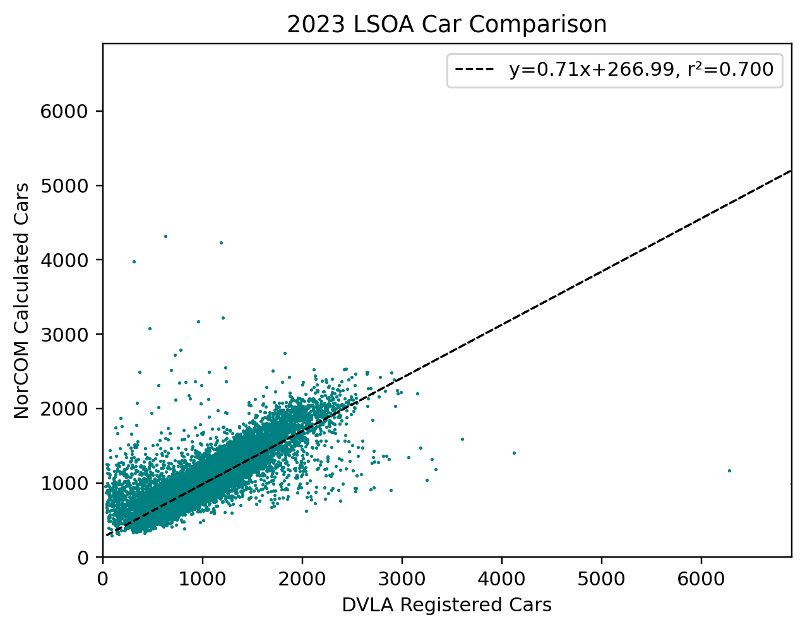

NorCOM Validation
#################

In addition to calibrating NorCOM to the 2021 Census, we have also compared the
results of the 2023 Land Use model (with NorCOM applied) to 2023 Driver and Vehicle
Licensing Agency (DVLA) data.

DVLA Data
=========

DVLA data [#dvla]_ provide total number of vehicles licensed in a given LSOA for
each quarter. The data currently go back to 2009. The data provide information on:

- body type (car, motorcycles, or other body types),
- keepership (company, private, or disposal), and
- licence status (licensed or SORN).

It should be highlighted that a comparison of "households with different levels
of car ownership" and "the number of vehicles registered" by zone is not a
like-for-like comparison. The DVLA data are based on the licensed location
of the vehicle, but there is no guarantee this is the same location as the
owner's household. Also, the DVLA data report absolute number of vehicles, whereas
the Land Use model is categorised into no-car, one-car, and two-or-more-car owning
households, so some assumptions are needed to allow a direct comparison of the
two data sets.

Assumptions
===========

For any comparison between DVLA and Land Use data we have assumed that the relevant
vehicles from the DVLA data are:

- body type: car or other,
- keepership: private, and
- licence status: licensed or SORN.

We have also used factors derived from the 2021 Census which approximate the
average number of cars in a household for households owning two-or-more cars. Note
these factors differ by LSOA.

Results
=======

:numref:`2023_total_cars` shows a summary of the comparison (using the assumptions
outlined above) of the total number of cars by LSOA in England between the 2023
Land Use model and the 2023 DVLA data.

.. _2023_total_cars:

   Number of Cars by LSOA; 2023 DVLA vs Land Use

This shows that overall the number of cars predicted through NorCOM is less than
the DVLA data, but there is limited variation in the scatter. There are clearly a
number of outlier data points which may indicate local differences in vehicle
licensing vs car ownership.

The below map shows a summary of the absolute differences in the
number of vehicles between the two data sources for LSOAs in the three Northern
regions (Land Use minus DVLA).

.. raw:: html
   :file: figs/total (absolute).html

This shows that (broadly) the level of difference between the two data sources
is consistent across zones, and small (in absolute terms). There are specific
zones which show larger (absolute) differences. For example, the zone with the
largest (absolute) difference from DVLA is LSOA E01007640 (NE of Doncaster) which
shows a dramatically larger number of vehicles registered than the Land Use model
predicts. Upon inspection, this LSOA contains BMW's UK vehicle distribution centre,
so it is not unsurprising that there may be oddities to do with vehicle
registrations in this zone.

A number of other outlier LSOAs were looked into and generally there was some
indication that the land use of the LSOA could explain the differences seen between
the two data sources.

.. rubric:: Footnotes

.. [#dvla] `Source (csv) <https://assets.publishing.service.gov.uk/media/68494ae1d98e01714306e07c/df_VEH0125.csv>`__
