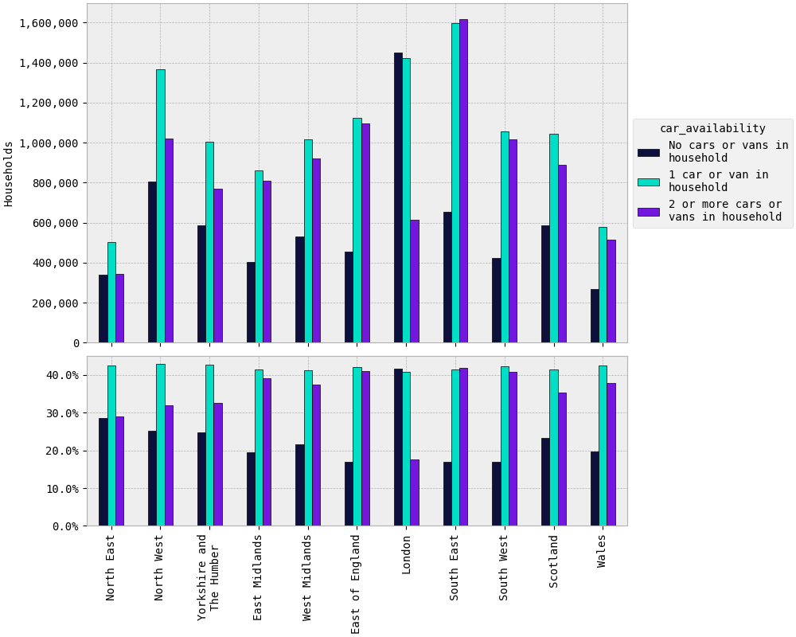

``car_availability``
####################

Plots
=====

Maps
====

.. raw:: html
   :file: car_availability (absolute).html

|

.. raw:: html
   :file: car_availability (proportional).html

|

Tables
======

.. rst-class:: right-align

.. csv-table::
   :file: car_availability.csv
   :header-rows: 1
   :align: right
