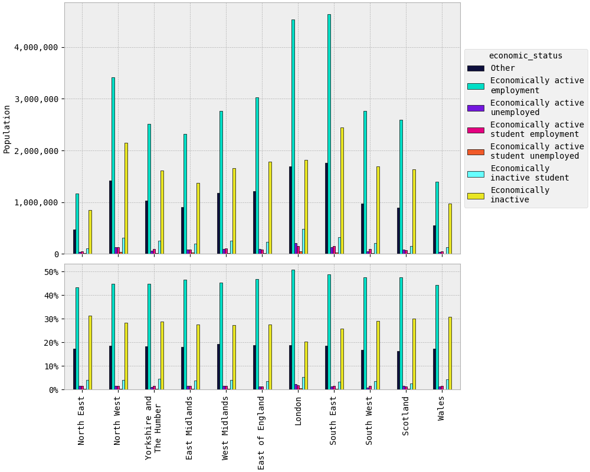

``economic_status``
###################

Plots
=====

Maps
====

.. raw:: html
   :file: economic_status (absolute).html

|

.. raw:: html
   :file: economic_status (proportional).html

|

Tables
======

.. rst-class:: right-align

.. csv-table::
   :file: economic_status.csv
   :header-rows: 1
   :align: right
