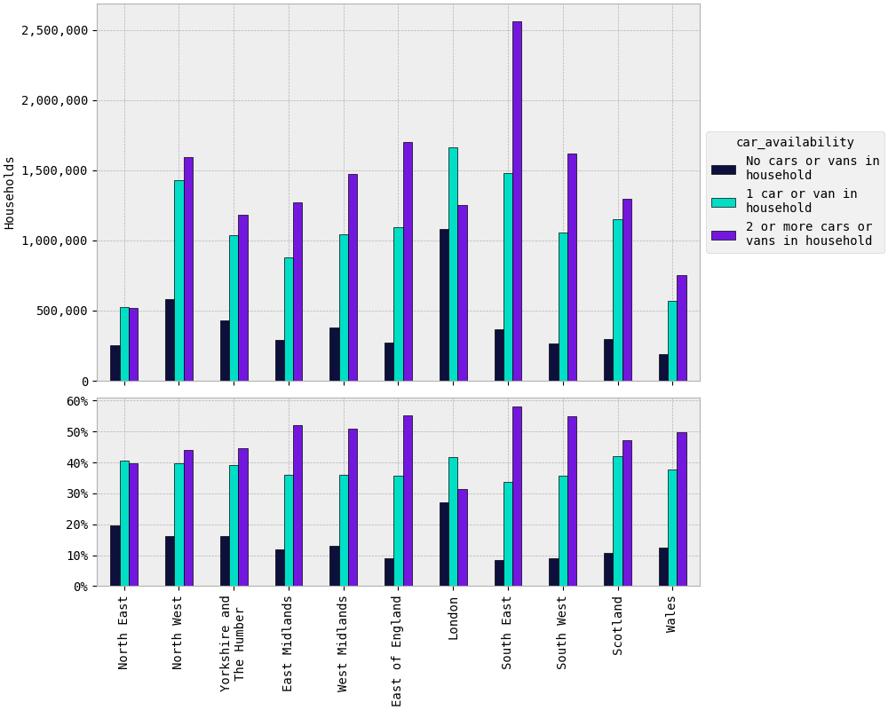

``car_availability_2043``
#########################

Plots
=====

Maps
====

Tables
======

.. rst-class:: right-align

.. csv-table::
   :file: car_availability_2043.csv
   :header-rows: 1
   :align: right
