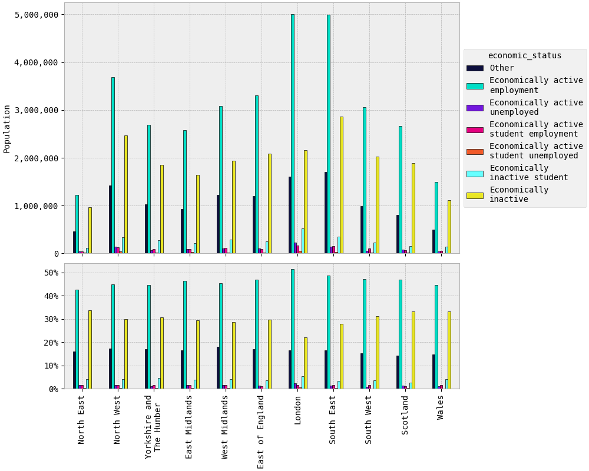

``economic_status_2038``
########################

Plots
=====

Maps
====

Tables
======

.. rst-class:: right-align

.. csv-table::
   :file: economic_status_2038.csv
   :header-rows: 1
   :align: right
